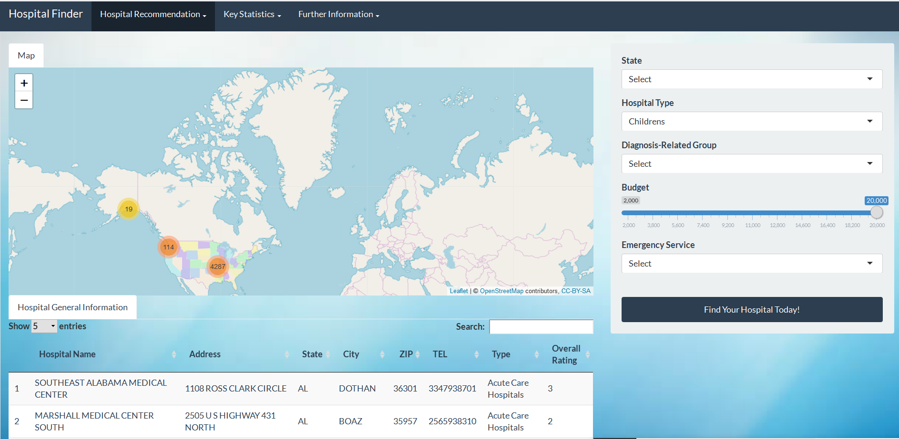

# Project 2: Find Your Hospital Today!

### [Project Description](doc/project2_desc.md)


## Hospital Finder App
Term: Fall 2018

+ Team #4
+ **KNOW YOUR HOSPITALS**: 
	+ Here is App link: (shiny app url)
 	+ Team members
		+ Zehan Wang
		+ Xiaojie Wei
		+ Ghada Jerfel
		+ Xiaoyi Li (Presenter)
		+ Peiqi Jin

+ **Project Summary**: 

Maintaining a good health is inevitably very important because it allows people to carry out daily life activities perfectly well. As such, in modern day times, people pay attention all the more to their personal health.
In attempt to help patients better explore the comparative cost of procedures and estimate the medical charges prior to receiving care, our group design an interactive app called "Hospital Finder" using Shiny app in R. This application will help patients find hospitals based on location, hospital type, estimated cost range and the availability of emergency services. This application also ranks all the hospitals that satisfy the criterias of certain measurments (such as safety of care of hte hospital) in order to help patients make personalized decisoins. Additionally, it visualizes interesting findings concerning the data it uses, which can be found under Key Statistics section.


+ **Data Introduction**: 
	+ Medicare Inpatient Charge Data: https://www.data.gov/health/hospital-charge-data/  
	+ Medicare Hospital Quality Data: https://data.medicare.gov/Hospital-Compare/Hospital-General-Information/xubh-q36u/data

+ **App Introduction**: The application has 3 sections:

	+ Hospital Recommendation: By selecting state, hospital type, disease type, expected cost range and emergency service, the app shows all tbe hospitals on the map and that satisfy such selections. At the bottom of this display, the app includes a  general information table about the hospitals.
	+ Key Statistic: This section includes statistics and interesting findings in the data including an interactive map that showcases important information for the app user as regards cost and that is based on the disease type and hospital type.
	+ Further Information: this section represents all the information about the data we used, helpful instructions for using the app, and information about the team members behind this app! 
	
	


+ **Contribution Statement**: 
All team members contributed to the GitHub repository and prepared for the presentation. All team members were actively involved in all stages of this project and helped design the app. All team members approve of the work presented in our GitHub repository including this contribution statement.
  + Zehan Wang: Designed the ui and server part of "Hospital recommendation" as well as the hospital map
  + Xiaojie Wei: Designed the ui and server part of "Key Statistics"
  + Ghada Jerfel: Designed the ui and server part of "Key Statistics"
  + Xiaoyi li: Designed the ui and server part of "Hospital Recommendation"
  + Perqi Jin: Desigedn the ui and server part of "Hospital Recommendation"


Following [suggestions](http://nicercode.github.io/blog/2013-04-05-projects/) by [RICH FITZJOHN](http://nicercode.github.io/about/#Team) (@richfitz). This folder is orgarnized as follows.

```
proj/
├── app/
├── lib/
├── data/
├── doc/
└── output/
```

Please see each subfolder for a README file.
